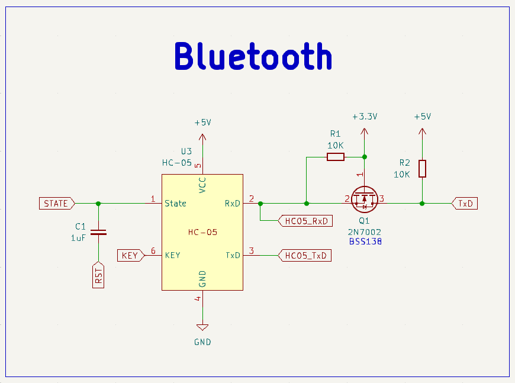
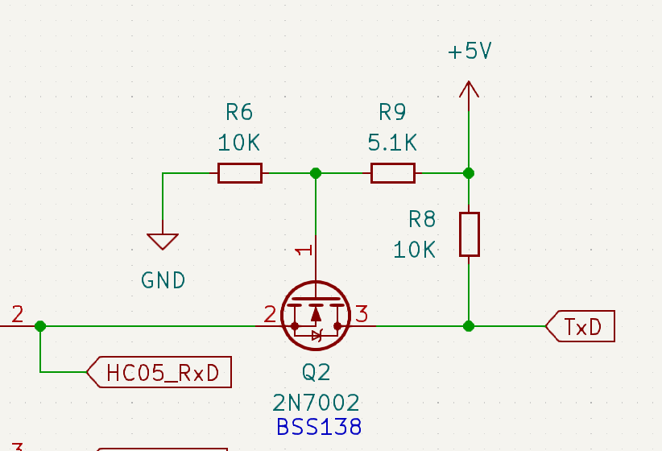
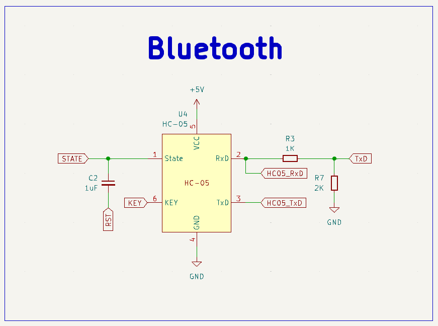
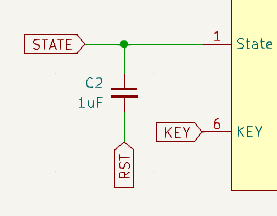

## What is this?

HC-05 모듈을 사용하여 아두이노에 무선으로 펌웨어를 업로드하기 위해 필요한 모듈 세팅을 수항하는 스케치입니다.  
간단한 AT 커맨드 설정과 회로 구성으로 HC-05 모듈의 State 핀을 아두이노를 위한 DTR 신호 전달 핀으로 사용할수 있습니다.  
이 스케치에 작성된 코드를 실행하면 HC-05 로 아두이노에 펌웨어를 업로드할때 사용자가 직접 리셋 버튼을 누르지 않아도 됩니다.

## Introduction

이 스케치는 `2.0-20100601` 버전의 펌웨어가 적용된 HC-05 모듈을 기준으로 작성되었습니다.  
2.0 보다 높은 버전의 펌웨어가 설치된 모듈에서는 AT 명령어 셋이 달라 사용할 수 없을 수 있습니다.

HC-05 모듈 AT 커맨드 설정시 아두이노와 통신은 소프트웨어 시리얼을 사용하여 연결됩니다.  
HC-05 모듈의 설정 과정을 시리얼 모니터로 관전 할 수 있습니다.  
자세한 내용은 [main.cpp](/src/main.cpp) 와 [HC_05.h](/lib/HC-05/HC_05.h) 파일을 참조하세요.

## HC_05 class

인스턴스 생성 및 셋업 과정에서 HC-05 모듈의 이름, 핀번호, 동작 모드 등을 설정할 수 있습니다.

```c
class HC_05 {
   public:
    HC_05(String uuid, String uart = "115200", String pswd = "0000", String polar = "1,0", String role = "0", String cmode = "1", int16_t pin = 4);

    void setATPort(int16_t pin);       // 블루투스 모듈 AT 명령 제어 핀
    void initDevice(int baud = 9600);  // HC_05 모듈 초기화
    void ATHead();
    void ATCommand(String s1, String s2 = "");  // 명령어 조합
    void ATEnd();
    void writeSerialString(String str, int n = 3);  // 문자열 전송

   protected:
    String AT_Feedback = "";
    String uuid_p;
    String uart_p;
    String polar_p;
    String pswd_p;
    String role_p;
    String cmode_p;
    int16_t key_p;
};
```

HC-05 모듈의 설정 완료후 펌웨어 업로드와 시리얼 통신에 사용하기 위해 회로를 다시 구성 해야합니다.  
다음 내용은 아두이노 스케치에도 포함되어있으니 시케치를 업로드한 후 시리얼 모니터를 열고 감상하면 됩니다.

```
1. HC-05 모듈의 RX 는 아두이노의 TX 에 연결합니다. (로직 레벨 컨버터 사용 권장!)
2. HC-05 모듈의 TX 는 아두이노의 RX 에 연결합니다.
3. HC-05 모듈의 State 핀과 아두이노의 Reset 핀 사이에 1uF 이상의 세라믹 콘덴서를 연결합니다.
4. 아두이노의 D4 에 연결된 Key 핀을 제거합니다.
5. PC 에서 블루투스 장치를 스캔하여 Arduino_Uno_BT 장치를 찾아 연결합니다.
6. 기본으로 설정된 블루투스 비밀번호는 0000 입니다.
7. HC-05 모듈이 PC와 성공적으로 연결되면 컴퓨테어 2개의 COM Port 가 생성됩니다.
8. 둘 중 하나의 COM Port 만 시리얼 통신으로 사용가능합니다.
9. 시리얼 통신이 가능한 포트가 펌웨어 업로드가 가능한 포트입니다
10. Blink 예제를 업로드하여 정상적으로 업로드되는 포트를 사용합니다.
11. 사용자가 리셋 버튼을 누르지 않아도 스스로 펌웨어가 업로드되면 DTR 설정이 정상적으로 완료된것입니다.
12. HC-05 모듈이 연결된 상태에서는 USB UART 를 정상적으로 사용할 수 없으니 주의가 필요합니다
```

## 로직 레벨 컨버터

### 첫 번쩨 방법 : 모스펫 사용

모스펫을 이용한 설계는 가장 추천하는 방법입니다.  
3.3V 와 5V 간 로직 레벨 컨버터로 양방향 통신에도 적용가능합니다.  
사용가능한 모스펫은 게이트-소스 역치 전압이 3.3V 미만인 `BSS138, 2n7000, 2n7002` 와 같은 제품이 권장됩니다.  
모스펫을 사용한 설계는 가장 높은 안정성과 성능을 보여줄 수 있습니다.  


### 두 번째 방법 : 모스펫 사용

마찬가지로 모스펫을 사용하지만 3.3V 를 공급받을 수 없을때 사용할 수 있습니다.  
5V 입력시 R9 에 5.1K 혹은 4.7K 의 저항을 사용하면 전압 분배 법칙에 의해 약 3.3V 를 얻을 수 있습니다.  


### 세 번째 방법 : 전압 분배

이 방법은 가장 저렴한 방법으로 저항만 사용합니다.  
추천하는 방법은 아니지만 빠르게 적용할 수 있고 비용을 아낄 수 있습니다.  


## DTR 회로 구성

**이 회로를 구성해줘야 시스템이 스스로 리셋을 하고 부트로더에 진입하여 펌웨어 업로드가 진행됩니다.**

일반적으로 DTR 과 Reset 사이에는 적당한 용량의 세라믹 콘덴서가 사용됩니다.  
HC-05 모듈의 경우 본래 DTR 신호 전달 기능이 있는 모듈이 아니기 때문에 정확성이 높은 편이 아닙니다.

다양한 용량의 세라믹 콘덴서로 테스트한 결과 1uF 이상의 콘덴서에서 괜찮은 수준의 리셋 타이밍으로 아두이노의 부트로더에 진입할수 있었습니다.  
DTR 리셋 동작은 콘데서의 용량이 적을수록 빠르고, 용량이 클 수로 안정적인 동작을 보여줍니다.  
그러나 콘덴서의 용량이 너무 작거나 너무 큰 경우 오히려 부정확한 동작을 가져올 수 있으니 적당한 용량의 콘덴서가 권장됩니다.  
1uF 정도면 충분합니다.



### 저렴한 비용 블루투스 무선 업로드 :7
